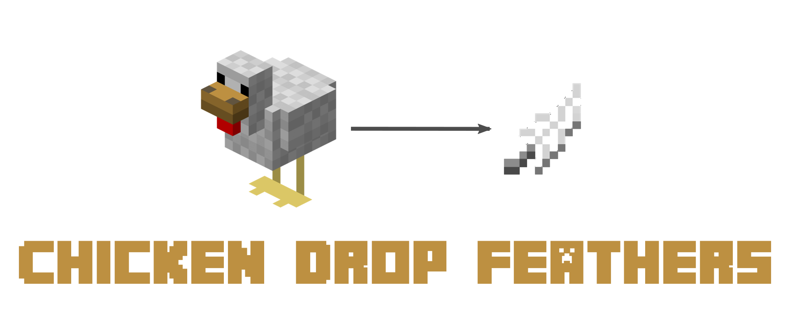

# minecraft-chicken-drop-feathers

> Chicken will drop feathers from time to time.

## Special thanks

Thanks to [d4rkm0nkey](https://github.com/d4rkm0nkey) for helping with the [FabricMC](https://fabricmc.net/) port.

## License

[GNU LGPLv3](LICENSE)
